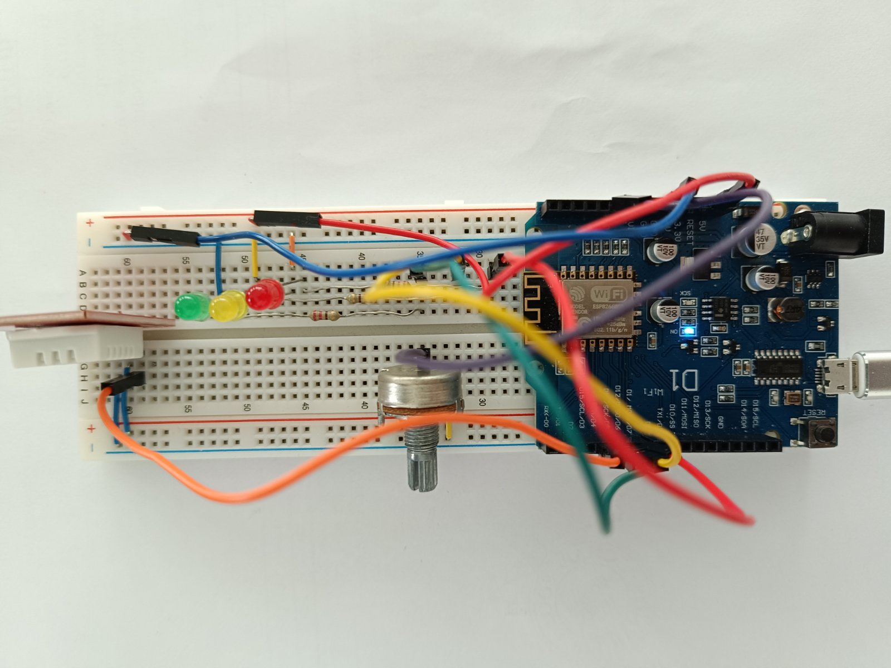

# ESP8266 IoT Project

This repository contains the code and documentation for an IoT project using the ESP8266 (ESP-12E) module, integrating with sensors and LEDs, and communicating with an AWS-hosted server.


>**Before you start: first clone this repository to your server!**

## Device photo


## Hardware Requirements

- ESP8266 ESP-12E module
- DHT22 temperature and humidity sensor
- Potentiometer
- LED lights (Red, Green, Yellow)
- Resistors for LEDs
- Breadboard and jumper wires

*Note: Detailed schematics will be uploaded shortly to guide you through the setup.*

## Software and Tools

### Arduino IDE Setup

1. Download and install the Arduino IDE from [Arduino's official website](https://www.arduino.cc/en/software).
2. Follow this guide to configure the Arduino IDE for ESP8266: [Programming ESP8266 with Arduino IDE](https://randomnerdtutorials.com/how-to-install-esp8266-board-arduino-ide/).

### Uploading Firmware to ESP8266

1. The `ino` code for the project can be found here: [ino.code](https://github.com/ivan-yosifov88/esp_presentation_demo/blob/main/esp_presentation_demo_device/esp_presentation_demo.ino).. Follow the steps in the Arduino IDE guide above to upload the firmware to your ESP8266 module.
*You have to adjust only the public server address and the ssid and pass to the Wi-Fi network* 
## Cloud Setup

### AWS Account

An AWS account is required for hosting the server component of this project. If you do not have an account, you can create one [here](https://aws.amazon.com/).

### Provisioning an AWS Ubuntu Server

After setting up your AWS account:

1. Launch an EC2 instance using the Ubuntu Server AMI.
2. Choose an instance type (e.g., t2.micro for testing purposes).
3. Configure instance details, storage, and security groups as needed.
4. Launch the instance and note down its public IP address.
5. Connect to your server via SSH.
6. Run the following commands to install all needed packages:
   ```bash
   sudo apt update -y
   sudo apt install -y mosquitto mosquitto-clients python3-pip nginx

### Mosquitto MQTT Broker Setup

The project uses Mosquitto as the MQTT broker. Follow these steps to set it up on your Ubuntu server:

1. Create password file to add client user and password so the user be able to connect with broker and allow service to listen to all interfaces
2. Run the following commands to configure Mosquitto:
   ```bash
   sudo touch /etc/mosquitto/passwd
   sudo mosquitto_passwd -b /etc/mosquitto/passwd esp8266 mqtt_very666Secret_p@ss
   sudo cp /etc/mosquitto/mosquitto.conf /etc/mosquitto/mosquitto.conf.bak
   sudo cp /home/ubuntu/esp_presentation_demo/mosquitto.conf /etc/mosquitto/mosquitto.conf
   sudo systemctl restart mosquitto


Refer to the [Mosquitto documentation](https://mosquitto.org/documentation/) for advanced configurations and usage.

### Application Service and Nginx Configuration

1. Copy the service application file from the repo to the appropriate location. 
2. Follow the steps provided in the repository to configure Nginx, including placing the Nginx configuration file found in the repo into `/etc/nginx/sites-available` and creating a symbolic link to it in `/etc/nginx/sites-enabled`.
3. Run the following commands to configure nginx: 
   ```bash
   sudo cp /home/ubuntu/nginx_esp_presentation_demo /etc/nginx/sites-available/esp_presentation_demo
   sudo cp /etc/nginx/sites-enabled/default /etc/nginx/sites-enabled/default.bak
   sudo ln -s /etc/nginx/sites-available/esp_presentation_demo /etc/nginx/sites-enabled
   sudo systemctl restart nginx
   
*Note: Detailed steps and scripts for setting up the application and Nginx will be added to the repository.*

### Adding the Flask Service File

To ensure your Flask application runs as a service and starts automatically on boot:

1. Navigate to the project folder and install needed python libraries 
2. Copy the systemd service file for the Flask app, in the `/etc/systemd/system/` directory and start the service.
   ```bash
   pip install -r reqirements.txt
   sudo cp /home/ubuntu/nginx_esp_presentation_demo/esp_presentation_demo.service /etc/systemd/system/esp_presentation_demo.service
   sudo systemctl start esp_presentation_demo.service
   sudo systemctl enable esp_presentation_demo.service
   
### Contributing

Your contributions are welcome! Please feel free to submit pull requests or open issues for any enhancements, bug fixes, or suggestions.
   